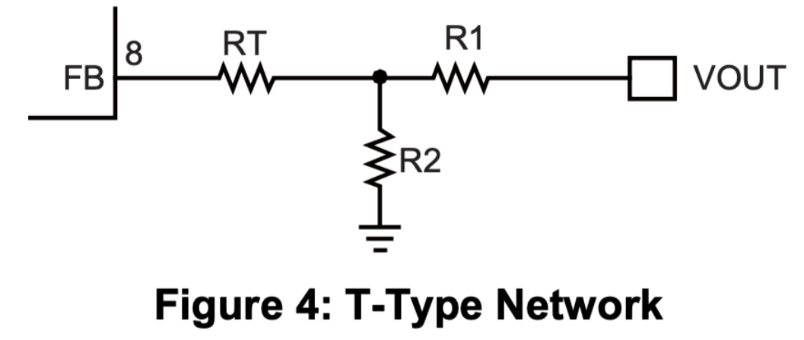

# 足轮式机器人

## 一、硬件

### 1.1 DCDC（电池管理模块）

介绍：机器人主体使用12V电池供电，由于舵机和STM32f103的供电电压不同，需要DCDC电池管理模块将12V降压为5V（舵机）和3.3V（单片机）

PCB设计：【新手不要怕！5分钟带你入门开关电源PCB设计】https://www.bilibili.com/video/BV1eU4y1A7uk?vd_source=493dd8ed3718f17d2162a21c61031e21

有两个版本可以选择：Altium Designer和嘉立创EDA（专业版）

文件夹位置：hardware\dcdc

> tip：如果舵机电压不够大的话，可以更换电阻，计算公式如下
>
> $$
> \mathrm{R}_{2}=\frac{\mathrm{R}_{1}}{\mathrm{V}_{{\mathrm{out}}}/0.791\mathrm{V}-1}
> $$
>
> 电路图如下：（一般只需要更换R2电阻就行）
>
> 

### 1.2 FOC驱动板

介绍：FOC驱动板的供电电压为12V，通过simpleFOC库进行控制，满足力矩、角度和速度三环，本项目使用力矩环进行控制

PCB设计：参考这个项目[https://oshwhub.com/hlchen2021/minifoc_v2]()，删减了OLED等模块，使得PCB板符合3205无刷电机的尺寸

有两个版本可以选择：Altium Designer和嘉立创EDA（专业版）

文件夹位置：hardware\minifoc

## 二、机械结构

介绍：机器人的机械结构设计文件

机械设计：参考这个项目[https://oshwhub.com/yigelunzifeixiang/zu-lun-ji-qi-ren]()，在实际的设计中，发现原来的机械结构容易断裂，重新加固了这些位置，以及将腿部结构的螺丝转孔扩大

有两个版本可以选择：.step和.f3d

文件夹位置：\mechanical structure
