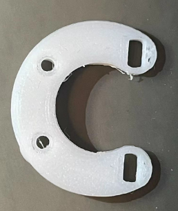

# 硬件讲解

## 一、DCDC模块

更换电阻可以改变输出电压

$$
\mathrm{R}_{2}=\frac{\mathrm{R}_{1}}{\mathrm{V}_{{\mathrm{out}}}/0.791\mathrm{V}-1}
$$

建议舵机供电可以大一些，6~7V左右，可以更换的控制舵机转动，通过换算可以得出，如果想要输出7V电压，R7需要更换为5.1K

## 二、FOC模块

### 2.1 3205无刷电机

无刷电机需要购买无限位电机

无刷电机淘宝可能没有货了，需要到闲鱼上买，记得要购买支撑架还有M2螺丝用于固定PCB板

### 2.2 元器件

元器件可以到深圳优信电子购买，一些电阻、电容还有STM32F103C8T6芯片，可以顺便购买ESP32（两个）和STM32最小系统板（一个），单片机建议多备一份

剩下的有DRV8313PWPR 和as5600，建议购买4份左右，以备用

## 三、其他模块

陀螺仪（MPU6050）

摇杆

oled屏

12v电池

舵机*2

醋酸胶带（10MM宽）

用来固定无刷电机和腿部结构

## 四、总体结构

