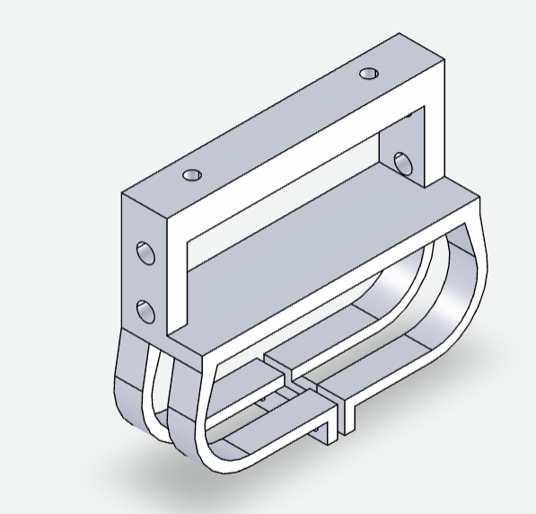
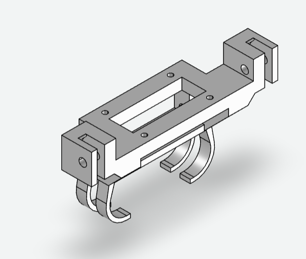
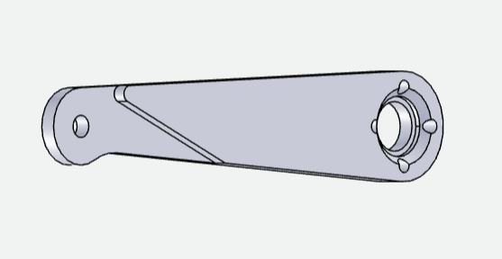
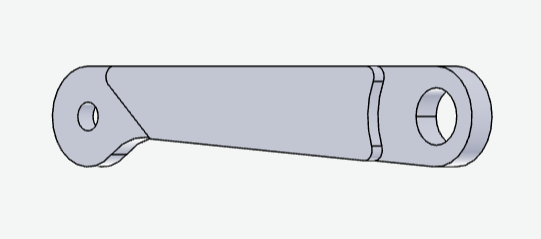
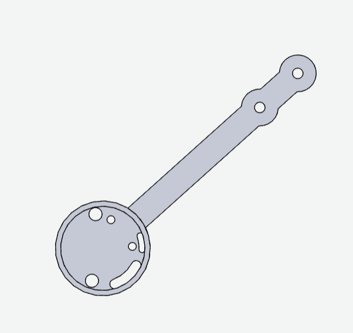
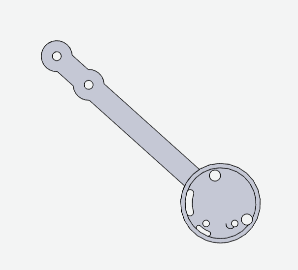

可以使用嘉立创网站打开3D文件：[3D预览器（Viewer.forface3d.com）](https://viewer.forface3d.com/home)

# 一、机器人主体和机器人腿部

## 1.1 机器人主体

### 前支撑

舵机固定螺丝规格：直径为3.00mm~3.5mm，长为1cm左右

### 后支撑

舵机固定螺丝规格：直径为3.00mm~3.5mm，长为1cm左右

副腿固定螺丝规格：直径为4mm，长为1.5cm左右

## 1.2 机器人腿部

### 大腿（镜像）

舵机固定螺丝规格：直径为2.5mm左右，长为0.5cm左右

小腿固定螺丝规格：直径为4mm，长为1.5cm左右

### 副腿（镜像）

小腿固定螺丝规格：直径为4mm，长为1.5cm左右

还需要4mm螺丝的螺母

### 右小腿

固定螺丝规格：直径为4mm，长为1.5cm左右

注意：FOC模块需要螺丝固定，直径为1mm，长为1cm，如果想要起固定作用的话，建议长2cm左右（还需要垫片）

### 左小腿

固定螺丝规格：直径为4mm，长为1.5cm左右

注意：FOC模块需要螺丝固定，直径为1mm，长为1cm，如果想要起固定作用的话，建议长2cm左右（还需要垫片）

